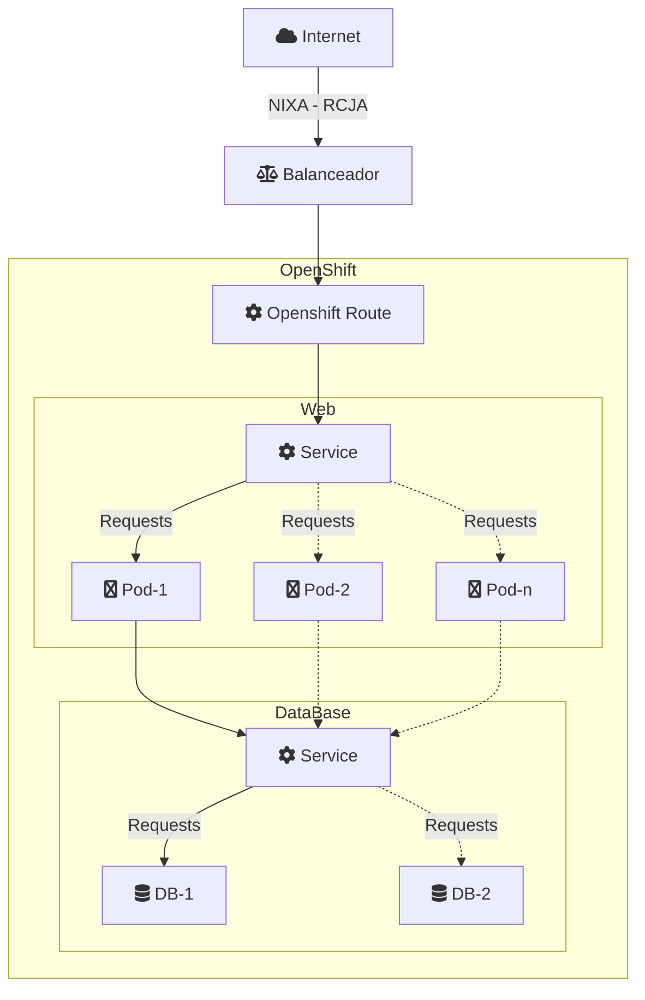

# Información adicional sobre el despliegue del PD en OpenShift.

## 0.1 Clonación (Fork) pd-web-wordpress-quickstart ##

1. Forkear pd-web-onepage-quickstart en el grupo creado
1. Renombrar el nuevo repositorio clonado

	Settings -> Advanced -> Rename repository -> Project name

	Settings -> Advanced -> Rename repository -> Project path

1. Crear rama develop

Si necesitas más información sobre uso y buenas prácticas:
https://gitlab.juntadeandalucia.es/documentacion/gitlab/blob/master/README.md

## 0.2 Despliegue plataforma Openshift ##

El Modelo de Servicios Digitales va más allá de proponer usar un conjunto de herramientas concretas, desarrollando y ofreciendo una serie de arquetipos a partir de los cuales poder comenzar a desarrollar. En el caso de un Micrositios WordPress, MSD ofrece un portal de referencia ya creado y configurado aplicando la normativa del MSD en cuanto diseño, configuración, tecnologías, etc.

De esta forma, el MSD ofrece los siguientes arquetipos en forma de imágenes OpenShift que deberán usar los equipos de desarrollo al inicio de este para poder montar la arquitectura de desarrollo inicial:

- Wordpress: El objetivo que persigue esta imagen es que todos los equipos de trabajo partan de la misma base, así como ahorrar un tiempo considerable en tareas repetitivas y de poco valor añadido.
Por ello para el despliegue de nuevos productos digitales Wordpress se partirá de esta imagen como portal de referencia ya desplegado, la cual contiene los siguientes elementos:

	- 	Sistema Operativo: Debian GNU/Linux 10
	- 	Wordpress 5.6.0
	- 	Versión de PHP 7.3.26
	- 	Versión Apache/2.4.38 (Debian)  

- MySql: Imagen disponible en el propio catálogo de OpenShift, la cual contiene los siguientes elementos:

	- BBDD: MySQL 5.7
	- Sistema Operativo: Red Hat Enterprise Linux Server release 7.6 (Maipo)

## 0.3 Creación PD Web Wordpress en OpenShift ##

Esta guía parte de la existencia de un proyecto creado en OpenShift con el propósito de albergar los servicios necesarios para desplegar nuestros productos digitales. 

El proveedor del producto digital tendrá la responsabilidad de personalizar en aquello que sea necesario los ficheros YAML proporcionados para ajustarlos a su producto digital (tamaño de volúmenes, usuarios/password de BD, etc.)

Las entregas de los proveedores serán auditadas por el equipo técnico del MSD con el fin de validar que se siguen las pautas indicadas por el modelo, así como evitar posibles errores humanos 

(Por ejemplo, el poner un tamaño de volumen de 1000 Gigabytes en lugar de 100 Gigabytes)
Con el fin de automatizar al máximo la preparación del entorno base para el comienzo de los desarrollos, se ha creado una plantilla templateWrodPressJDA.yaml, la cual realiza el despliegue de todos los elementos necesarios para el inicio de un Micrositio Wordpress agilizando con ello el inicio de los desarrollos.

Podemos descargar la plantilla desde la siguiente URL:

[https://gitlab.juntadeandalucia.es/pd-webapp-templates/pd-web-wordpress/blob/master/templateWordPressJDA.yaml ](https://gitlab.juntadeandalucia.es/pd-webapp-templates/pd-web-wordpress/blob/master/templateWordPressJDA.yaml  "https://gitlab.juntadeandalucia.es/pd-webapp-templates/pd-web-wordpress/blob/master/templateWordPressJDA.yaml ")

Una vez descargada, el primer paso que tenemos que realizar es importarla en el proyecto creado en la plataforma OPS. Para ello nos dirigimos a la opción Add to Project --> Import Yaml / Json

Una vez pulsado se nos abre una ventana donde incluimos la plantilla descargada 

Una vez importada la plantilla, al pulsar sobre el botón ‘Create’, se despliega una nueva ventana en la que deberemos seleccionar ‘Process the template’ y pulsar el botón ‘Continue’.

Posteriomente, se procede al despliegue del proyecto donde se crean los Pods correspondientes (Base de Datos y servidor Apache-PHP-Wordpress)
Durante este proceso de despliegue, se crean todos los elementos necesarios (imagen, build, Deployment, service, route, …) para el funcionamiento del nuevo producto digital y así poder continuar con la gestión del contenido acorde a las necesidades de cada proyecto sin necesidad de mayor configuración.

## 0.4 Cliente OpensShift (oc). ##
La plataforma OpenShift dispone de un cliente para trabajar desde la línea de comandos e incluso a veces necesario para determinadas funcionalidades. Dicho cliente puede ser descargado desde:

Windows: 

- Url descarga : [https://github.com/openshift/origin/releases/download/v3.11.0/openshift-origin-client-tools-v3.11.0-0cbc58b-windows.zip ](https://github.com/openshift/origin/releases/download/v3.11.0/openshift-origin-client-tools-v3.11.0-0cbc58b-windows.zip  "https://github.com/openshift/origin/releases/download/v3.11.0/openshift-origin-client-tools-v3.11.0-0cbc58b-windows.zip ")

Una vez descargado basta con copiar los ficheros dentro de C:\Windows\System32 para tenerlos disponibles desde la consola de comandos.

Linux:

- Url descarga :
[https://github.com/openshift/origin/releases/download/v3.11.0/openshift-origin-client-tools-v3.11.0-0cbc58b-linux-64bit.tar.gz ](https://github.com/openshift/origin/releases/download/v3.11.0/openshift-origin-client-tools-v3.11.0-0cbc58b-linux-64bit.tar.gz  "https://github.com/openshift/origin/releases/download/v3.11.0/openshift-origin-client-tools-v3.11.0-0cbc58b-linux-64bit.tar.gz ")

Una vez descargado basta con copiar los ficheros dentro de /usr/local/bin para poder ejecutarlos desde la línea de comandos.

### 0.4.1 Copia de contenido desde o hacia el Pod ###
Tanto para la copia de contenido desde como hacia el Pod, es necesario el uso de la herramienta OC facilitado por Red Hat (en el anterior apartado se ha descrito como instalarlo). A continuación, se muestra los comandos a ejecutar para tal efecto

•	Para copiar contenido desde nuestro equipo al Pod desplegado en la plataforma OPS:

	$ oc rsync <nombre del pod>:/src /home/user/source

•	Para copiar contenido desde el Pod desplegado en la plataforma OPS a nuestro equipo:

	$ oc rsync /home/user/source <nombre del pod>:/src

### 0.4.2 Conexión Base de Datos desplegada en OPS  ###
Para acceder al contenido de la Base de datos desplegada en la plataforma OPS. Podemos o bien acceder desde el terminal del Pod desplegado o para una mayor comodidad desde nuestro IDE habitual.

Para acceder desde el terminal del Pod simplemente accedemos al terminal y conectarnos con el cliente a la Base de Datos.

	$ mysql -h 127.0.0.1 -u admin -p

En el caso que deseemos acceder mediante nuestro IDE habitual, debemos redireccionar el puerto desde el POD a nuestro equipo. Para ello ejecutamos el comando que se muestra a continuación. 

	$ oc port-forward <nombre del POD que ejecuta la BD> 3306:3306

Es importante que este comando se ejecute en una consola de comandos independiente y que una vez finalizado con las pruebas necesarias se detenga el proceso.

Una vez realizada la redirección podemos acceder desde nuestro IDE usando la conexión: 

	•	IP: localhost
	•	Puerto: 3306
	•	Base de datos: wordpress

# 0.5. Publicación PD 📽️

Para la publicación del PD, una vez que esté disponible en producción, el responsable del PD deberá:
1. Notificar la publicación del sitio en DevOps (o correo al cau.transparenciayportal@juntadeandalucia.es) para que se gestionen los siguientes aspectos:
  * Inclusión de las monitorizaciones
  * Obtener la autorización del centro directivo responsable de la publicación a la ciudadanía 
2. Realizar los pasos internos del organismo para solicitar la publicación a RCJA.
  * La publicación del sitio en producción debe apuntar a 10.240.215.200
  * Normalmente existirá un responsable de gestionar peticiones con RCJA, tratalo con el patrocinador del proyecto y pide soporte a DevSecOps si tenéis dudas.
3. Crear el "route" que soporte la publicación del servicio
  * El responsable deberá introducir el certificado en la modalidad "edge"
  * Existe la posibilidad de que el certificado se instale en el balanceador, para lo cuál deberá hacer una petición especifica en Devops

# 0.6. Esquema de servicio

